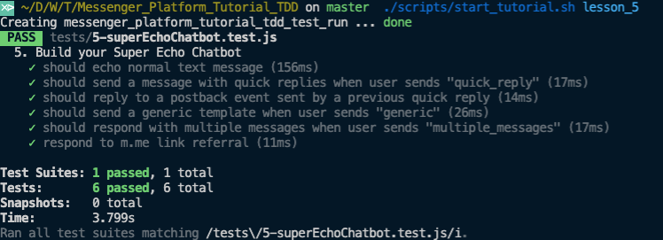

# Messenger_Platform_Tutorial_TDD

Welcome to this tutorial made for the [Developer Circle Community Challenge 2020](https://developercircles2020.devpost.com). This tutorial was built using the concepts of TDD ([Test Driven Development](https://www.infoq.com/articles/test-driven-design-java/)), where I have prepared all the tests for you so that you can have each lesson in the **Red State**🔴. In each lesson, you are job will be turning these red states one by one into green ones, hence, complete the tutorial.

Hence you can consider this tutorial is **2 in 1** tutorial, from one side it is a tutorial designed to cover the [Messenger Platform](https://developers.facebook.com/docs/messenger-platform) and how to build a chatbot using the platform, and from the other side (As a By-product) you will get more familiar with TDD and how to use it in real life applications.

<p align="center">
  
</p>

before going into the tutorial itself, make sure to follow read the following in order to proceed with setup and preparations.

### License

[](https://github.com/mohamedluay/Messenger_Platform_Tutorial_TDD)

### Technologies Used


### Installation Guide

In order to use this tutorial, all you need to have is a [docker desktop app](https://www.docker.com/products/docker-app) so that you can build the image and start the container. Steps:

1.  Clone this repo.
2.  Go to the root folder in the master branch in the terminal, and run the following command:

```
./scripts/start_docker.sh test
```

**start_docker.sh** is a shell script I wrote to run this container main commands & services. If you want to force building this image, you can append **--build** to the same command

```
./scripts/start_docker.sh test --build
```

This test container is configured as a test environment that you can use to follow up with the lessons. For the TDD part and each lesson preparation, I have wrote another script that you will use to get the tests of each lesson, e.g:

```
./scripts/start_tutorial.sh lesson_5
```

In a green state, it will look something like this 📸 👇



### VSCode Plugins

I am using VSCode as the main code editor, hence I have been using some plugins where some of them might be of a very good use for this tutorial:

1.  [Better Comments](https://marketplace.visualstudio.com/items?itemName=aaron-bond.better-comments) (I use this one specifically to highlight each lesson part).
2.  [ESLint](https://marketplace.visualstudio.com/items?itemName=dbaeumer.vscode-eslint).
3.  [Prettier](https://marketplace.visualstudio.com/items?itemName=esbenp.prettier-vscode)
4.  [CodeMetrics](https://marketplace.visualstudio.com/items?itemName=kisstkondoros.vscode-codemetrics)

### [Start Tutorial (In English)](tutorials/english/README.md)
