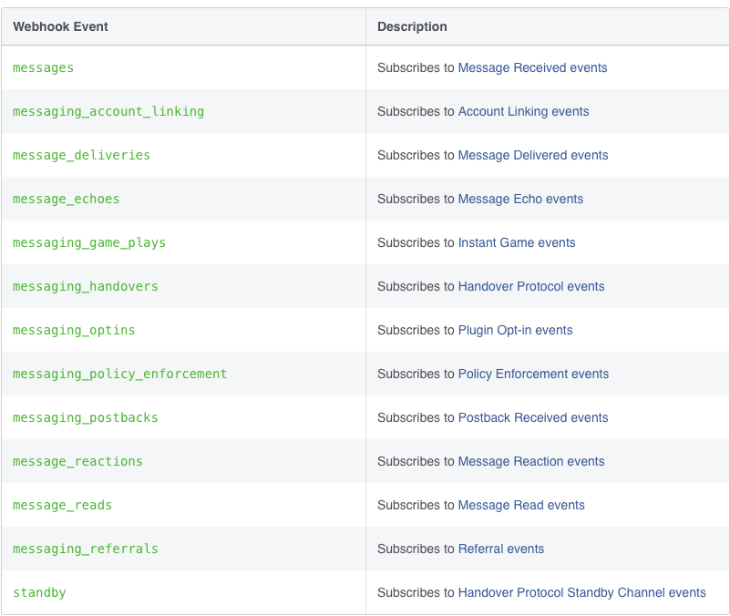

# Lesson 3 - Parsing Messaging Events

## In theory 📖

By now you have already configured your facebook App, did your webhooks and ready to deal with different types of events received from the messenger platform. The messenger platform now supports various types of webhook events, from messaging, referrals, postbacks, to account linking and message deliveries. The image below from the official documentation show all the available events 👇.



By now, most probably you will be asking yourself, should I implement all these events?!

The clear answer is no, they are all optional events, matter of fact you shouldn't do it unless it is relevant to the desired experience you want to deliver to your users, hence, start minimal and gradually start supporting relevant events when needed.

### Quick Description Of Common Events

#### Messages

The most commonly used one, it is the event responsible for receiving different user messages and this is the one we will be focusing on in the next lesson from this tutorial.

#### Messaging Account Linking

If you already have users and they are using your system/app and you want to identify them when using your chatbot, then this is the event you would be using for identifying and linking them to your main application.

#### Message Deliveries

This event will notify you if a specific message you have sent to your user has been delivered or not. Most of the time you won't need to use this event, unless your notifying your user with an important update and you need to make sure that the update have been notified or otherwise you want to execute another thing to make sure he/she being notified.

#### Message Echoes

This event will fire ab echoed message event whenever your app sends a message to a user. Typically, you don't need to use this event unless you are looking for a some sort of a handover or reporting scenario.

#### Messaging Game Plays

#### Messaging Handover

#### Messaging Opt Ins

#### Messaging Policy Enforcement

#### Messaging Postbacks

#### Message Reactions

#### Message Reads

#### Messaging Referrals

#### Standby

In this tutorial we will be mainly focusing on messages, postbacks, & referrals since they are the most commonly used events for the other events, we will be adding them gradually to the webhook events appendix lessons.

## Get Your Hands Dirty 👩‍💻

There is no Major work to be done in this lesson as we will be covering different event types parsing in the subsequent lessons, all what you need to do is to prepare the manager that will be responsible for parsing and let the webhook method use it. Although it is a simple step, we will not leave it un tested, hence when you run lesson 3 command, the test will just make sure that the webhook function invoke the parsing function with the correct parameters.

Now, search for the usual todo comment, for this lesson, it will be

```javascript
// ToDo: Lesson 3
```

Then invoke the parsing function from **webhookEventsManager.js** with the webhook event that you want to parse. With this updates, the webhook function now should be looking like this 👇

```javascript
// ToDo: Lesson 2
const data = req.body;
const { object, entry } = data;
if (object === 'page') {
    entry.forEach((entryEvent) => {
        try {
            const webhookEvent = entryEvent.messaging[0];
            const { sender, recipient, timestamp } = webhookEvent;
            // ToDo: Lesson 3
            const parsedEvent = parseEvent(webhookEvent);
            res.status(200).send('EVENT_RECEIVED');
        } catch (error) {
            res.status(500).send();
        }
    });
} else {
    res.sendStatus(404);
}
```

Run the lesson command now again, it should go green as usual 👌

```sh
./scripts/start_tutorial.sh lesson_3
```

## Citation

Documentation Reference:

-   [Webhook Events](https://developers.facebook.com/docs/messenger-platform/webhook#events)

## Next Lesson: [Lesson 3.1 - Parsing Message Event](Lesson_3_1.md)

[](https://twitter.com/_mluay)
